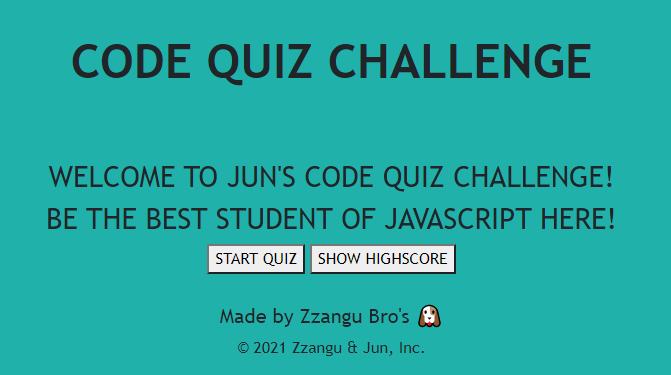
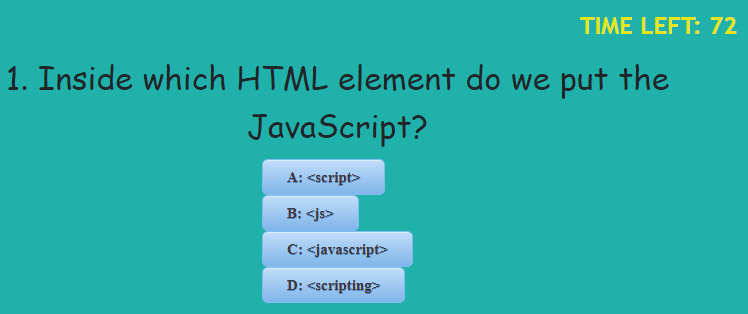
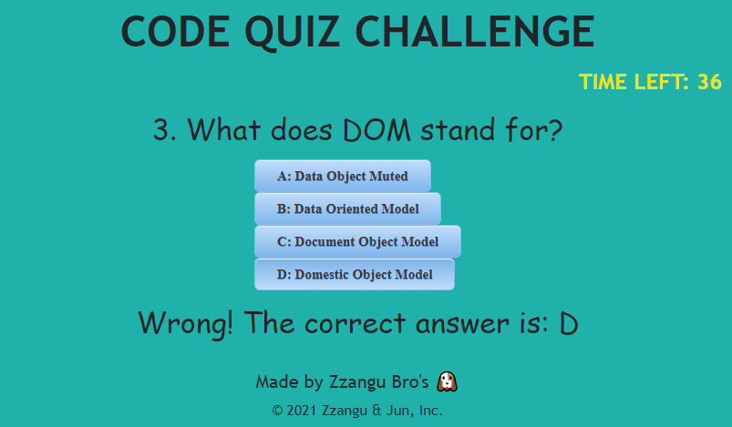
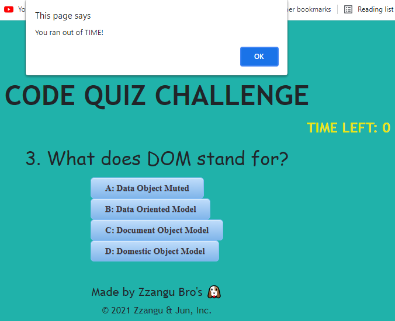
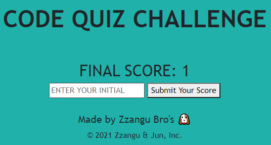
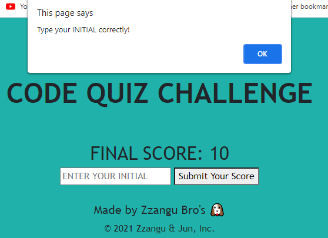
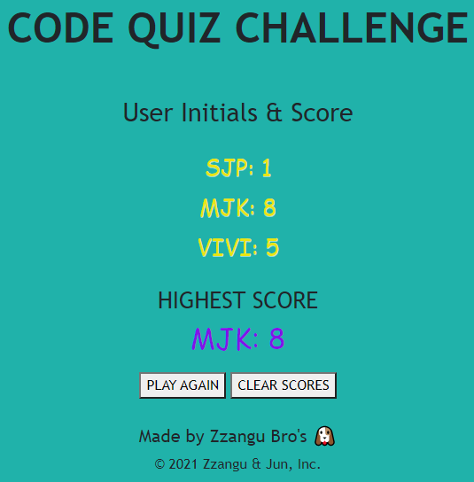
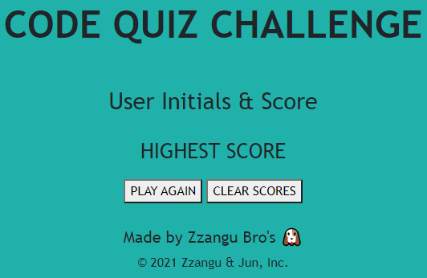

# Code Quiz Challenge
If you want to test out your knowledge of **JavaScript**?  
Come take a well-made quiz here! [**Jun's Code Quiz**](https://zzangu0215.github.io/BootCamp-Homework4-Code_Quiz/)

## Features

1. You can **START** the quiz, and go directly to see **HIGH SCORES** in the **MAIN page**. 

    

2. Once you click **START QUIZ** button, you can see the question and answer options, and also how many seconds left. 

    

3. Once you choose an answer, it will let you know whether your choice is correct or wrong. If you pick a wrong one, you lost **10 seconds** from timer! Ouch!

    |  |  | 
    |----|----|

4. If the **TIME LEFT** is going to be **0**, it will let you know you ran out of the time, then if you press **OK**, it will directly let you go to the **Score Submission** page.

    

5. Either you successfully finish the quiz, or you run out of time, you will see the final score submission page! Oops! If you do not enter your initial, but leave it as blank and press the **Submit Your Score** button, it will alert you!

     |  | 
    |----|----|

6. After you successfully submit your initial, it will show your score and the other users' scores, and also the **HIGHEST** score of the lists! For sure, you can clear all the scores and start over the quiz 😀. 

     |  | 
    |----|----|

That's it! Go ahead see the demo video below and go ahead play the quiz!

## Demo Video

Here is the [**Demo Video Link**](https://youtu.be/1dvT11q3tHE)

## Author

- **Jun Park**
    - Portfolio: [Portfolio](https://zzangu0215.github.io/BootCamp-Homework2/) (to be changed)
    - Email: tajo0215@gmail.com
    - SNS: https://www.instagram.com/o0ojunny/